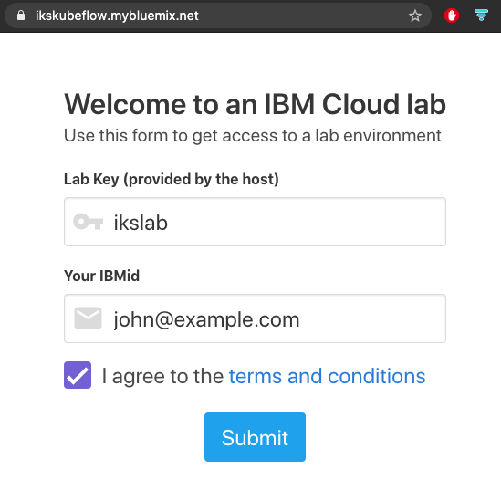
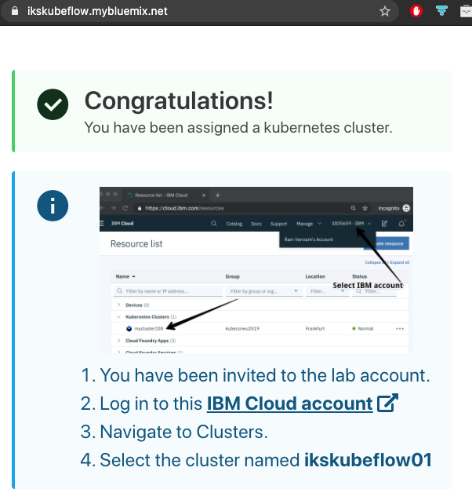

# Deploy Kubeflow on IBM Cloud

## Access to IBM Cloud workshop cluster

If you already have access to an IBM Cloud Kubernetes cluster, please use it for the following experiment. If not, you will be provided a cluster just for the purpose of this handson.

* Create an `IBMid`

(Optional) If you do not have an `IBMid`, go to [IBM Cloud](https://ibm.biz/Bdqgck) to create an account to access IBM Cloud clusters. For IBM internal developers, you can use your internet id with SSO to access IBM Cloud.

* Install CLI tools to access IBM Kubernetes cluster

```shell
curl -sL https://ibm.biz/idt-installer | bash
```

* Request access to a workshop cluster

(Optional) There are a limited number of workshop clusters for the live dojo session. If you need the access to one of the clusters, open your browser with [`https://ikskubeflow.mybluemix.net`](https://ikskubeflow.mybluemix.net), enter `ikslab` as the lab key and your IBMid email to request a cluster .

Once the request gets through, follow the `IBM Cloud account` link to view the cluster info .

* Access the cluster

```shell
ibmcloud ks cluster config --cluster <cluster_name/id>
```
Replace the `<cluster_name/id>` with the cluster name or id provided to you.

* Login to IBM Cloud

```shell
ibmcloud login -a cloud.ibm.com -r us-south

# if you have a federated id
# ibmcloud login -a cloud.ibm.com -r us-south --sso
```

Note: if you have multiple accounts, choose `1840867 - Advowork`.

## Set up IBM Cloud Block Storage

* Install `Helm` with these [instructions](https://helm.sh/docs/intro/install/)

```shell
# on MacOS
brew install helm
```

* Install IBM Cloud Block Storage

```shell
# add helm charts
helm repo add iks-charts https://icr.io/helm/iks-charts
helm repo update

# install
helm install 1.6.0 iks-charts/ibmcloud-block-storage-plugin -n kube-system
```

* Make the IBM Cloud Block Storage the default `storageclass`

```shell
kubectl patch storageclass ibmc-block-gold -p '{"metadata": {"annotations":{"storageclass.kubernetes.io/is-default-class":"true"}}}'
kubectl patch storageclass ibmc-file-bronze -p '{"metadata": {"annotations":{"storageclass.kubernetes.io/is-default-class":"false"}}}'
```

There are two approaches to deploy Kubeflow. Either through Kubeflow Operator or `kfctl` CLI. Choose one of the two options to experiment Kubeflow deployment.

## 1. Kubeflow deployment through `kfctl` CLI

### Install `kfctl`

`kfctl` can be downloaded from Kubeflow kfctl releases [link](https://github.com/kubeflow/kfctl/releases). For this workshop, the latest version should be used. Follow the instructions below to download the pre-built `kfctl` on `master` branch.

```shell
wget https://github.com/IBM/KubeflowDojo/raw/master/Binaries/kfctl_v1.1-rc.0-13-ga5b668b_$(uname | tr '[:upper:]' '[:lower:]').tar.gz
tar zxvf kfctl_v1.1-rc.0-13-ga5b668b_$(uname | tr '[:upper:]' '[:lower:]').tar.gz
chmod +x kfctl
mv kfctl /usr/local/bin
```

### Deploy Kubeflow with `kfctl` CLI

* Run the deployment with application manifests specified for IBM Cloud

```shell
cd $HOME
mkdir kfdef
cd kfdef
kfctl apply -V -f https://raw.githubusercontent.com/IBM/KubeflowDojo/master/manifests/kfctl_ibm_tekton.yaml
```

* Check the deployment

```shell
kubectl get ns
kubectl get pods -n istio-system
kubectl get pods -n kubeflow
```

Wait until all pods and services are up and running in the `kubeflow` namespace than continue to the next steps.

### Access Kubeflow dashboard

  Thereare two approaches to access the dashboard. To access the dashboard with the cluster ip, run following:

  - Retrieve cluster ip

  ```shell
  export CLUSTER_IP=$(kubectl get node -o wide|grep Ready|awk '{print $7; exit}')
  ```

  Now you can access the dashboard through `http://$CLUSTER_IP:31380`.

  Another approach is to use port forwarding as follow:

  - Port forward `istio-ingressgateway`

  ```shell
  kubectl port-forward --namespace istio-system $(kubectl get pod --namespace istio-system --selector="app=istio-ingressgateway" --output jsonpath='{.items[0].metadata.name}') 8080:80&
  ```

  - Access the dashboard through `localhost:8080`

Follow the instructions to have the profile namespace created and run a pipeline tutorial.

### Delete the Kubeflow deployment

Only do this once you are don't need this Kubeflow deployment.

* Delete the current Kubeflow

```shell
cd kfdef

# to workaround some resources cleanup problem with current kfctl cli
wget https://raw.githubusercontent.com/IBM/KubeflowDojo/master/manifests/kustomization.yaml
kustomize build --load_restrictor=none . >o.yaml
kubectl delete -f o.yaml

kfctl delete -f kfctl_ibm_tekton.yaml

# manually remove some leftover webhooks
kubectl delete mutatingwebhookconfigurations --all
kubectl delete validatingwebhookconfigurations --all
```

## 2. Kubeflow deployment through Kubeflow operator

Follow the [instructions](https://github.com/kubeflow/kfctl/blob/master/operator.md) to deploy the Kubeflow operator. Alternatively, if clusters have access to [Operator Lifecycle Manager](https://github.com/operator-framework/operator-lifecycle-manager), the Kubeflow Operator is also available in [operatorhub.io](https://operatorhub.io/) and can be accessed in clusters' operator catalog for quick install.
  
### Install `kustomize`

Follow this [link](https://kubernetes-sigs.github.io/kustomize/installation/) to install `kustomize`.

On MacOS, this is one single command

```shell
brew install kustomize
```

### Clone `kfctl` repo

```shell
cd $GOPATH/src
mkdir -p github.com/kubeflow
cd github.com/kubeflow
git clone https://github.com/kubeflow/kfctl.git
```

### Deploy Kubeflow Operator

```shell
cd $GOPATH/src/github.com/kubeflow/kfctl
export OPERATOR_NAMESPACE=operators
kubectl create ns ${OPERATOR_NAMESPACE}

cd deploy/
kustomize edit set namespace ${OPERATOR_NAMESPACE}
kustomize build | kubectl apply -f -
```

* Check `${OPERATOR_NAMESPACE}` for the operator

```shell
kubectl get pods -n ${OPERATOR_NAMESPACE}
```

### Create Kubeflow deployment with the operator

```shell
cd $HOME
mkdir kfdef
cd $HOME/kfdef
rm -rf .cache *
wget https://raw.githubusercontent.com/IBM/KubeflowDojo/master/manifests/kfctl_ibm_tekton.yaml
sed -i '' '/metadata:/a\'$'\n\  ''name: kubeflow\'$'\n' kfctl_ibm_tekton.yaml

KUBEFLOW_NAMESPACE=kubeflow
kubectl create ns ${KUBEFLOW_NAMESPACE}
kubectl create -f kfctl_ibm_tekton.yaml -n ${KUBEFLOW_NAMESPACE}
```

* Watch the progress

```shell
kubectl logs deployment/kubeflow-operator -n ${OPERATOR_NAMESPACE} -f
```
### Access Kubeflow dashboard

To access the dashboard with the cluster ip, run following:

  - Retrieve cluster ip

  ```shell
  export CLUSTER_IP=$(kubectl get node -o wide|grep Ready|awk '{print $7; exit}')
  ```

  Now you can access the dashboard through `http://$CLUSTER_IP:31380`.

### Delete the Kubeflow deployment

Only do this once you are don't need this Kubeflow deployment.

```shell
kubectl delete -f kfctl_ibm_tekton.yaml

# manually remove some leftover webhooks
kubectl delete mutatingwebhookconfigurations --all
kubectl delete validatingwebhookconfigurations --all
```

## Use `tekton pipelines`

* Install CLI follow the [instructions](https://github.com/tektoncd/cli#installing-tkn)

```shell
# on MacOS
brew tap tektoncd/tools
brew install tektoncd/tools/tektoncd-cli
```

* Access `tekton dashboard`

```shell
kubectl port-forward -n tekton-pipelines svc/tekton-dashboard 9097:9097&
```

To access, from browser [`http://localhost:9097`](http://localhost:9097).

## Misc tasks

### Enable LoadBalancer for Istio-ingressgateway

To enable a dedicated LoadBalancer IP for Kubeflow, run:
```shell
kubectl patch svc istio-ingressgateway -n istio-system -p '{"spec": {"type": "LoadBalancer"}}'
```

### Remove namespaces stuck with finalizers

```shell
kubectl proxy&
pid=$!
nss="kubeflow istio-system knative-serving cert-manager"
for ns in $nss; do
  kubectl delete ns $ns --force --grace-period=0
  kubectl get namespace $ns -o json |jq '.spec = {"finalizers":[]}' >temp.json
  curl -k -H "Content-Type: application/json" -X PUT --data-binary @temp.json 127.0.0.1:8001/api/v1/namespaces/$ns/finalize
done
kill -9 $pid
```

### Install Go tools

* Install `go` following this [link](https://golang.org/dl/)

  After install, do following to set up the environment
  
  ```shell
  mkdir -p $HOME/go/src
  export GOPATH=$HOME/go
  ```

### Build `kfctl`

* Clone and build `kfctl`

  - Clone

  ```shell
  cd $GOPATH/src
  mkdir -p github.com/kubeflow
  cd github.com/kubeflow
  git clone https://github.com/kubeflow/kfctl.git
  ```

  - Build

  ```shell
  cd kfctl
  make build
  export PATH=$PWD/bin:$PATH
  ```

### `kfctl` source code walkthrough with VSC

- Install `Go` extension
- Open the folder to `$GOPATH/src/github.com/kubeflow/kfctl`
- Run/Debug test from the IDE
- Debug within VSC

Refer to [Kubeflow on IBM Cloud](https://www.kubeflow.org/docs/ibm/install-kubeflow/) for all details.
