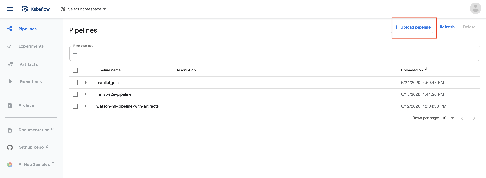
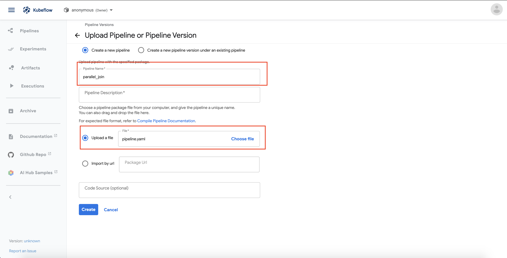
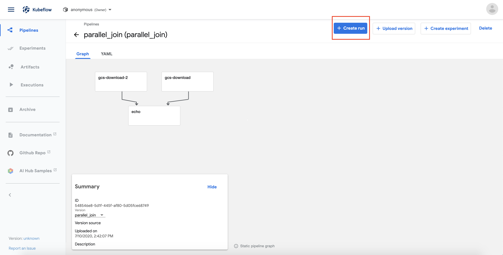
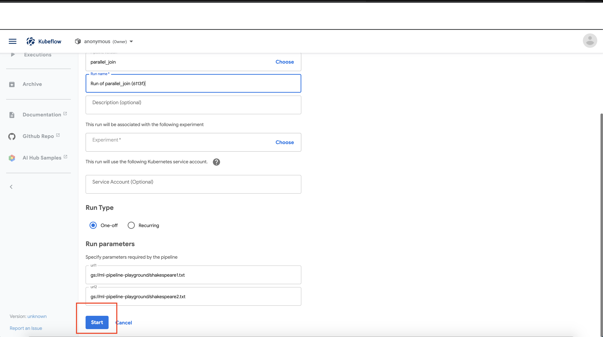
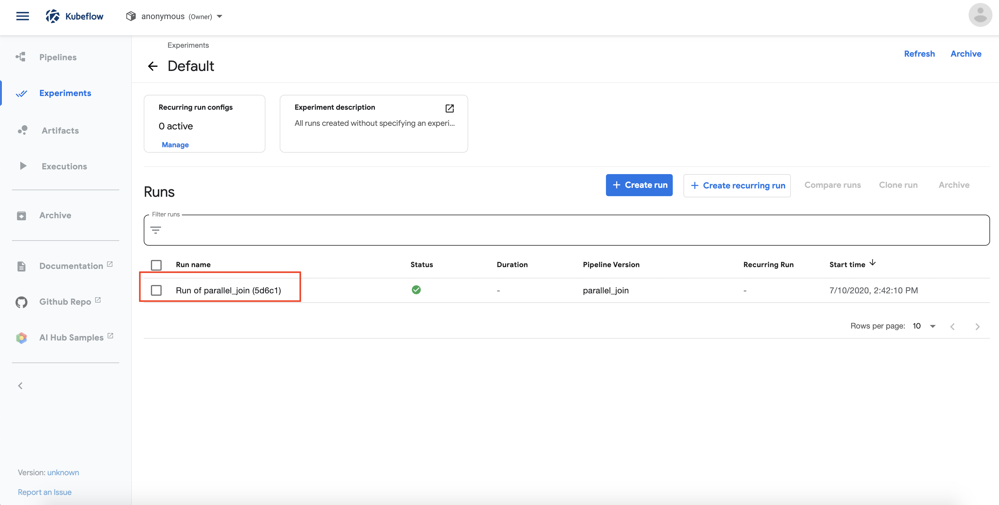
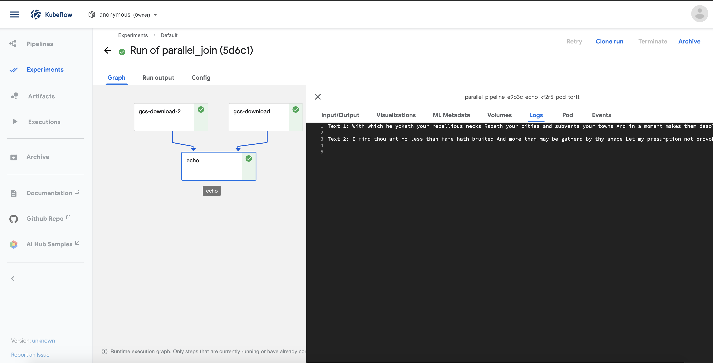

# Run pipelines using the Kubeflow Pipeline Dashboard

Once you have followed the instructions to [compile pipelines](README.md#compiling-a-kubeflow-pipelines-dsl-script), you can upload the compiled yaml using Kubeflow Pipeline dashboard and run it. Below are the instuctions

1. Go to the Kubeflow main dashboard(Endpoint of the istio-ingressgateway) and click on the **Pipelines** tab on the left panel. Then click on the **Upload pipeline button**.

2. Then, click on **Upload a file** and select our compiled pipeline file. Then click on **Upload** at the end to upload the pipeline.

Now, we should able to see the pipeline is being uploaded to the **Pipelines** page. 

3. Once we have the pipeline uploaded, we can simply execute the pipeline by clicking on the pipeline name. Then click **Create run** on the pipeline page. 

4. Next, click **Start** to execute the pipeline.

5. Now, the pipeline is executing and we can click on the pipeline run to view the execution graph.

