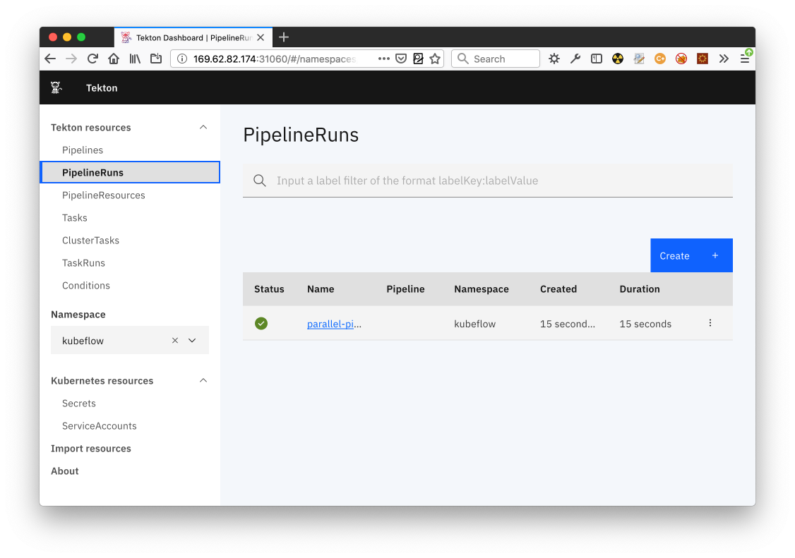
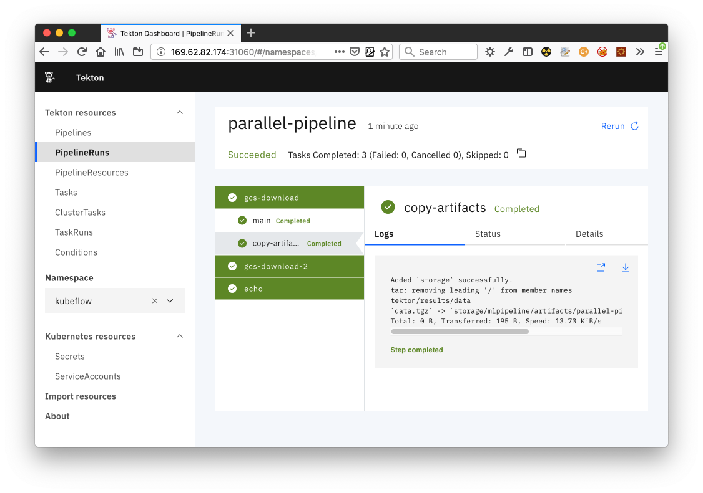

# Kubeflow Pipelines with Tekton - Compiler (Dojo Day 2 Hands-On)

In this Hands-On we will go into detail on the KFP-Tekton project, how to compile
Kubeflow Pipelines to Tekton YAML and run the pipeline with Tekton on a
Kubernetes cluster.


# Table of Contents

- [Prerequisites](#prerequisites)
  - [Installing Tekton](#installing-tekton)
    - [Tekton Cluster](#tekton-cluster)
    - [Tekton CLI](#tekton-cli)
    - [Tekton Dashboard](#tekton-dashboard)
  - [Install KFP-Tekton Compiler](#install-kfp-tekton-compiler)
- [Compiling a Kubeflow Pipelines DSL Script](#compiling-a-kubeflow-pipelines-dsl-script)
- [Running the Pipeline on a Tekton Cluster](#running-the-pipeline-on-a-tekton-cluster)
- [Finding the PipelineRun in the Tekton Dashboard](#finding-the-pipelinerun-in-the-tekton-dashboard)
- [Optional: Compiling to Argo YAML (KFP Default)](#optional-compiling-to-argo-yaml-kfp-default)


# Prerequisites

1. [_Python_](https://www.python.org/downloads/): version `3.7` or later
2. [_Kubernetes_ Cluster](https://v1-15.docs.kubernetes.io/docs/setup/): version `1.20` ([required by Kubeflow](https://www.kubeflow.org/docs/started/k8s/overview/) and Tekton 0.30)
3. [`kubectl` CLI](https://kubernetes.io/docs/tasks/tools/install-kubectl/): required to deploy Tekton pipelines to Kubernetes cluster
4. [_Tekton_ Deployment](https://github.com/tektoncd/pipeline/releases/tag/v0.13.0/): version `0.30.0` (or greater to support Tekton API version `v1beta1`), required for end-to-end testing
5. [`tkn` CLI](https://github.com/tektoncd/cli#installing-tkn): required to work with Tekton pipelines
6. [_Kubeflow Pipelines_](https://www.kubeflow.org/docs/pipelines/installation/overview/) Deployment: required for some end-to-end tests


## Installing Tekton

A working Tekton cluster deployment is required to perform end-to-end tests of the pipelines generated by the
`kfp_tekton` compiler. The Tekton CLI is useful to start a pipeline and analyze the pipeline logs.

### Tekton Cluster

Follow the instructions listed [here](https://github.com/tektoncd/pipeline/blob/release-v0.30.x/docs/install.md#installing-tekton-pipelines-on-kubernetes)
or simply run:
```
kubectl apply -f https://storage.googleapis.com/tekton-releases/pipeline/previous/v0.30.0/release.yaml
```

**Note**, if your container runtime does not support image-reference:tag@digest (like cri-o used in OpenShift 4.x),
use `release.notags.yaml` instead.

Enable custom task controller and other feature flags for kfp-tekton
```Bash
kubectl patch cm feature-flags -n tekton-pipelines \
      -p '{"data":{"enable-custom-tasks": "true", "enable-api-fields": "alpha"}}'
```
Optionally, for convenience, set the default namespace to `tekton-pipelines`:
```
kubectl config set-context --current --namespace=tekton-pipelines
```

### Tekton CLI

Follow the instructions [here](https://github.com/tektoncd/cli#installing-tkn). 

Mac OS users can install the Tekton CLI using the `homebrew` formula:
```
brew tap tektoncd/tools
brew install tektoncd/tools/tektoncd-cli
```

### Tekton Dashboard

Follow the installation instructions [here](https://github.com/tektoncd/dashboard/blob/main/docs/install.md#installing-tekton-dashboard-on-kubernetes), i.e.:
```
kubectl apply --filename https://storage.googleapis.com/tekton-releases/dashboard/latest/tekton-dashboard-release.yaml
```

The Tekton Dashboard can be accessed through its `ClusterIP` service by running `kubectl proxy` or the service can
be patched to expose a public `NodePort` IP:
```
kubectl patch svc tekton-dashboard -n tekton-pipelines --type='json' -p '[{"op":"replace","path":"/spec/type","value":"NodePort"}]'
```

To open the dashboard run:
```
TKN_UI_PORT=$(kubectl -n tekton-pipelines get service tekton-dashboard -o jsonpath='{.spec.ports[0].nodePort}')
PUBLIC_IP=$(kubectl get nodes -o jsonpath='{.items[0].status.addresses[?(@.type=="ExternalIP")].address}')
open "http://${PUBLIC_IP}:${TKN_UI_PORT}/#/pipelineruns"
```

## Install KFP-Tekton Compiler

1. Clone the `kfp-tekton` repo:

   ```
   git clone https://github.com/kubeflow/kfp-tekton.git
   cd kfp-tekton
   ```

2. Setup Python virtual environment:

   ```
   python3 -m venv .venv
   source .venv/bin/activate
   ```

3. Install the `kfp_tekton` compiler:

   ```
   pip install -e sdk/python
   ```

4. Run the compiler tests (optional):

   ```
   make test
   ```


# Compiling a Kubeflow Pipelines DSL Script

The `kfp-tekton` Python package comes with the `dsl-compile-tekton` command line
executable, which should be available in your terminal shell environment after
installing the `kfp-tekton` Python package.

If you cloned the `kfp-tekton` project, you can find example pipelines in the
`samples` folder or under `sdk/python/tests/compiler/testdata` folder.
```
dsl-compile-tekton \
        --py sdk/python/tests/compiler/testdata/parallel_join.py \
        --output pipeline.yaml
```

# Running the Pipeline on a Tekton Cluster

After compiling the `sdk/python/tests/compiler/testdata/parallel_join.py` DSL script
in the step above, we need to deploy the generated Tekton YAML to our Kubernetes
cluster with `kubectl`. The Tekton server will automatically start a pipeline run
for which we can follow the logs using the `tkn` CLI. 

Here we have to deploy the pipeline in the kubeflow namespace because all the pipelines with metadata
and artifacts tracking rely on the minio object storage credentials in the kubeflow namespace.
```
kubectl apply -f pipeline.yaml -n kubeflow
    
tkn pipelinerun logs --last -n kubeflow
```

Once the Tekton Pipeline is running, the logs should start streaming:
```
Waiting for logs to be available...

[gcs-download : main] With which he yoketh your rebellious necks Razeth your cities and subverts your towns And in a moment makes them desolate

[gcs-download : copy-artifacts] Added `storage` successfully.
[gcs-download : copy-artifacts] tar: removing leading '/' from member names
[gcs-download : copy-artifacts] tekton/results/data
[gcs-download : copy-artifacts] `data.tgz` -> `storage/mlpipeline/artifacts/parallel-pipeline/gcs-download/data.tgz`
[gcs-download : copy-artifacts] Total: 0 B, Transferred: 195 B, Speed: 1 B/s

[gcs-download-2 : main] I find thou art no less than fame hath bruited And more than may be gatherd by thy shape Let my presumption not provoke thy wrath

[gcs-download-2 : copy-artifacts] Added `storage` successfully.
[gcs-download-2 : copy-artifacts] tar: removing leading '/' from member names
[gcs-download-2 : copy-artifacts] tekton/results/data
[gcs-download-2 : copy-artifacts] `data.tgz` -> `storage/mlpipeline/artifacts/parallel-pipeline/gcs-download-2/data.tgz`
[gcs-download-2 : copy-artifacts] Total: 0 B, Transferred: 205 B, Speed: 1 B/s

[echo : main] Text 1: With which he yoketh your rebellious necks Razeth your cities and subverts your towns And in a moment makes them desolate
[echo : main]
[echo : main] Text 2: I find thou art no less than fame hath bruited And more than may be gatherd by thy shape Let my presumption not provoke thy wrath
[echo : main]
```

# Finding the PipelineRun in the Tekton Dashboard

1. From the Terminal, run the following commands to open the **PipelineRuns** on the Tekton dashboard:

   ```Bash
   TKN_UI_PORT=$(kubectl get service tekton-dashboard -n tekton-pipelines -o jsonpath='{.spec.ports[0].nodePort}')
   PUBLIC_IP=$(kubectl get nodes -o jsonpath='{.items[0].status.addresses[?(@.type=="ExternalIP")].address}')
   open "http://${PUBLIC_IP}:${TKN_UI_PORT}/#/pipelineruns"
   ```

2. The Tekton Dashboard should open with the **PipelineRuns** tab selected:
   
   
 
3. Click on the `parallel-pipeline` in the table and select the individual tasks
   to see the log output:
   
   


# Optional: Compiling to Argo YAML (KFP Default)

If a [_Tekton_ Cluster](#tekton-cluster) deployment is not available, compiling the Kubeflow Pipeline DSL scripts to
Argo YAML works very similar to the [compilation step](#compiling-a-kubeflow-pipelines-dsl-script) described above.
Instead of the `dsl-compile-tekton` command, use the `dsl-compile` executable, which should be available in your
terminal shell environment after installing either the `kfp-tekton` or the `kfp` Python package. The output should be
a `.tar.gz` file in order to upload the compiled pipeline to the Kubeflow Pipelines web interface.

    dsl-compile \
        --py sdk/python/tests/compiler/testdata/parallel_join.py \
        --output pipeline.tar.gz
        
Take a look at the Kubeflow Pipelines documentation to learn more about
[compiling Kubeflow Pipeline samples on the command line][dsl-compile-tutorial] and read through the
[Pipelines Quickstart tutorial][kubeflow-pipelines-tutorial] to learn about using the Kubeflow Pipelines
web interface.


<!-- external links -->

[dsl-compile-tutorial]: https://www.kubeflow.org/docs/pipelines/tutorials/build-pipeline/#compiling-the-samples-on-the-command-line
[kubeflow-pipelines-tutorial]: https://www.kubeflow.org/docs/pipelines/pipelines-quickstart/
