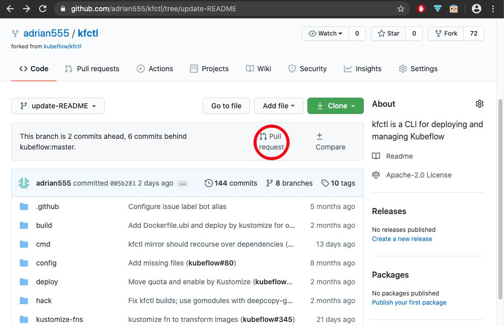

# PR workflow

## Coverage

1. Find and claim an issue to work on
2. Write codes + tests
3. Submit the patch for review
4. PR is merged

## Browse issues in `kfp-tekton` project

* Open the [link](https://github.com/kubeflow/kfp-tekton/issues) and find an issue to work on
* Alternatively you can create a new issue to work on
* Fork the master repo `https://github.com/kubeflow/kfp-tekton.git`
* Clone forked repo to `$GOPATH/src/github.com/kubeflow`

```shell
cd $GOPATH/src/github.com/kubeflow
git clone https://github.com/<github_id>/kfp-tekton.git
cd kfp-tekton
git remote add upstream https://github.com/kubeflow/kfp-tekton.git
```

Replace <github_id> with your github id.

* From your IDE or Terminal window, create a branch for the issue and checkout the branch

## Write codes and unit tests

Write codes and unit test cases with your IDE. Run and debug the code. Before commit, run `make test` to make sure any change you make does not break the project.

## Submit the patch for review

Commit all the changes you make either through the IDE or command line `git commit`.

Periodically you may want to merge with the upstream changes by doing following:

```shell
git fetch upstream
git merge upstream/master
```

Once ready, push the commit to the forked repo either through your IDE or command line `git push`. Provide your github credential if asked.

Now, open the browser and go to the forked repo `github.com/<github_id>/kfp-tekton`. Switch to the branch you created for the issue, and create a new pull request. E.g. 

## PR is merged

Open the browser to view the pull request you just created `github.com/kubeflow/kfp-tekton/pull/<nubmer>`. Replace <number> with your PR number.

Now it is up to the community to reivew and finally approve the PR. If there is any review comments, you are expected to fix with new commits.
