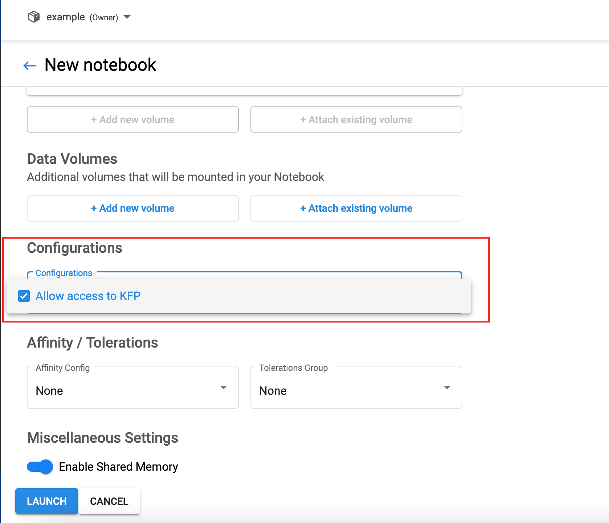

# Kubeflow Dojo Day 1 HandsOn

In today's HandsOn, we will go over how to create a Jupyter Notebook on Kubeflow, run some python example code, and executing
the Kubeflow pipeline using the permission we have within the Kubeflow Jupyter Notebook Server.

## Instructions

1. Go to the Kubeflow dashboard. It should be `<cluster_id>:30380` or `localhost:8080` if you use port-forward.
   Log in with the username and password you specified when deploying Kubeflow.

2. Set up a `PodDefault` in the user's namespace to allow Notebook Server to access Pipeline APIs. Use the following
   PodDefault as the template:
   ```
   apiVersion: kubeflow.org/v1alpha1
    kind: PodDefault
    metadata:
    name: access-kf-pipeline
    namespace: example
    spec:
    desc: Allow access to KFP
    selector:
        matchLabels:
        access-kf-pipeline: "true"
    volumeMounts:
        - mountPath: /var/run/secrets/kubeflow/pipelines
        name: volume-kf-pipeline-token
        readOnly: true
    volumes:
        - name: volume-kf-pipeline-token
        projected:
            sources:
            - serviceAccountToken:
                path: token
                expirationSeconds: 7200
                audience: pipelines.kubeflow.org
    env:
        - name: KF_PIPELINES_SA_TOKEN_PATH
        value: /var/run/secrets/kubeflow/pipelines/token
   ```
   Change the `namespace` to your user's namespace, save the file as `poddefault.yaml`, and use the following command to
   create the PodDefault:
   ```
   kubecel apply -f poddefault.yaml
   ```
2. Click on the `Notebooks` tab on the left-hand panel.
   

3. Click on the `New Server` button.


4. Give any name to your Notebook Server, and keep the rest with the default settings.
   
   In `Configurations` section, select `Allow access to KFP`
   
   At the end of the form, click on the `Launch` button.
   

5. Once the Notebook Server is ready, click on the `Connect` button to access the Notebook Server.
   

6. Within the Notebook Server, click upload and select the `lightweight_component.ipynb` example in this directory. Then click on the notebook and
start running code using the Jupyter Notebook running on Kubeflow. The rest of the instructions are within the Jupyter Notebook.
   
   

