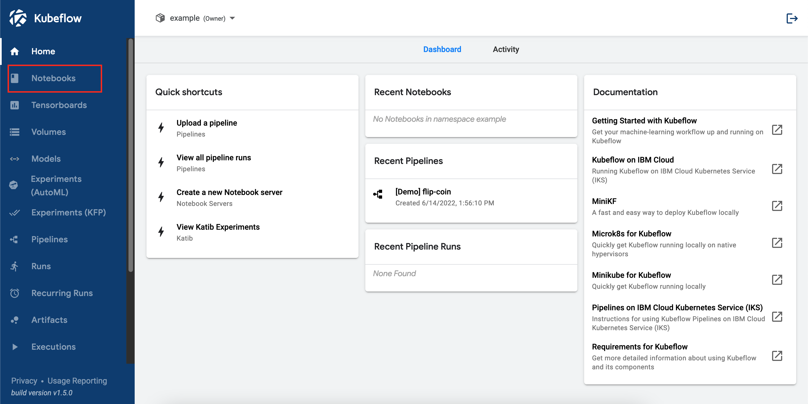
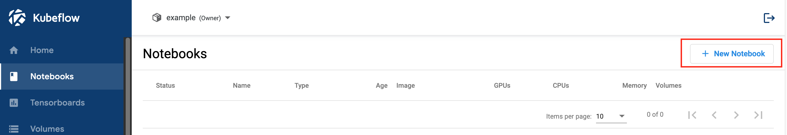
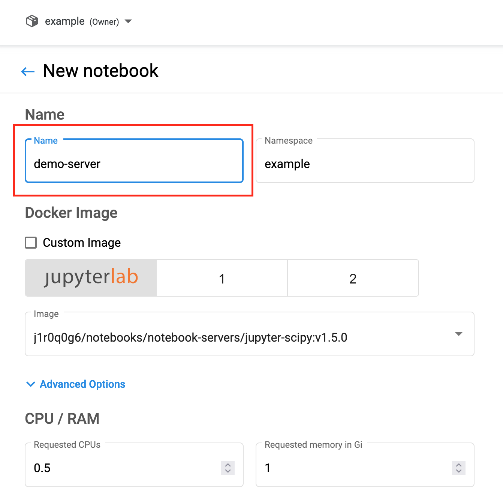
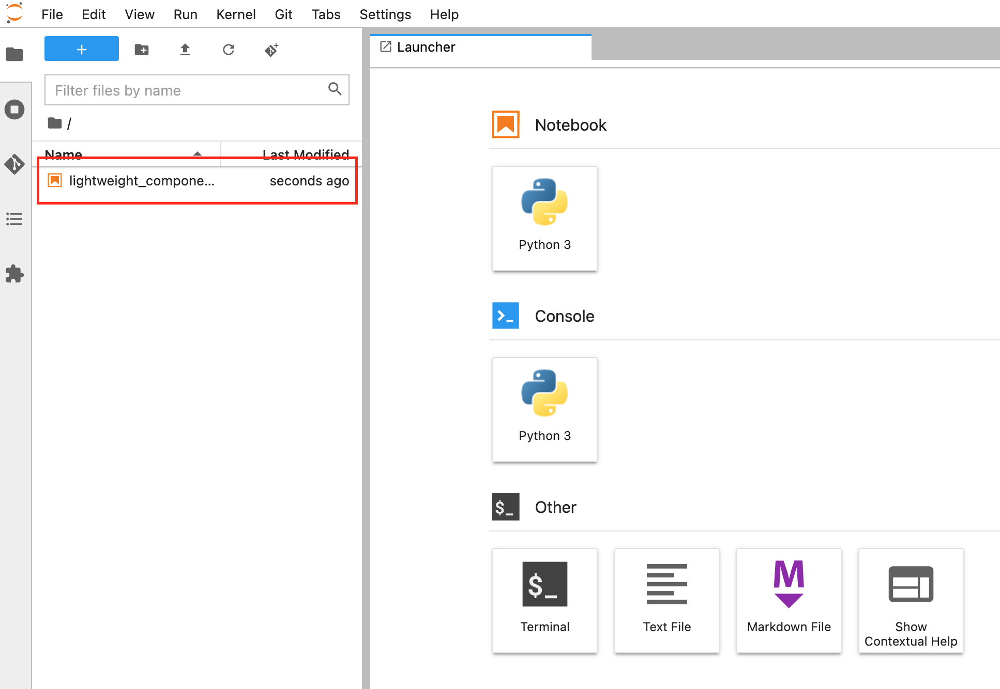

# Kubeflow Dojo Day 1 HandsOn

In today's HandsOn, we will go over how to create a Jupyter Notebook on Kubeflow, run some python example code, and executing
the Kubeflow pipeline using the permission we have within the Kubeflow Jupyter Notebook Server.

## Instructions

1. Go to the Kubeflow dashboard. It should be `<minikube/public_ip>:31380`. Then create a username call `anonymous`. 

2. Click on the `Jupyter Servers` tab on the left-hand panel.

3. Click on the `New Server` button.

4. Give any name to your Jupyter Server, and keep the rest with the default settings. At the end of the form, click on the `Launch` button.

5. Once the Jupyter Server is ready, click on the `Connect` button to access the Jupyter Server.

6. Within the Jupyter Server, click upload and select the `lightweight_component.ipynb` example in this directory. Then click on the notebook and
start running code using the Jupyter Notebook running on Kubeflow. The rest of the instructions are within the Jupyter Notebook.

