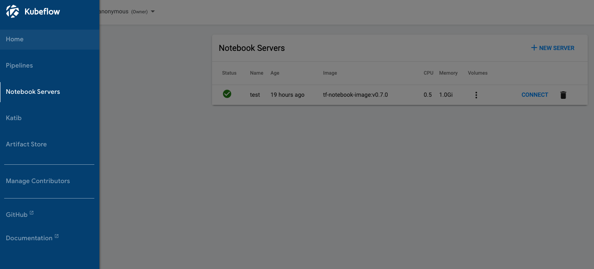

## KfServing on OpenShift

- [KfServing on OpenShift](#kfserving-on-openshift)
  - [Prerequisites](#prerequisites)
  - [Deploy Kubeflow with KfServing](#deploy-kubeflow-with-kfserving)
  - [Access the Kubeflow Dashboard](#access-the-kubeflow-dashboard)
  - [Create and Connect to Notebook Server](#create-and-connect-to-notebook-server)
  - [Add `cluster-admin` to `pipeline-runner`](#add-cluster-admin-to-pipeline-runner)
  - [Enable user namespace to run KfServing](#enable-user-namespace-to-run-kfserving)
  - [Run KfServing Notebook example](#run-kfserving-notebook-example)
  - [Run other KfServing examples](#run-other-kfserving-examples)
  
### Prerequisites

Follow the [Prepare OpenShift cluster environment](./README.md#prepare-openshift-cluster-environment) to set up the cluster environment.

### Deploy Kubeflow with KfServing

Choose [kfctl_openshift_tekton_kfserving.v1.1.0.yaml](./kfctl_openshift_tekton_kfserving.v1.1.0.yaml) to deploy the required components for single-user Kubeflow with Tekton backend.

```shell
export KFDEF_DIR=<path_to_kfdef>
mkdir -p ${KFDEF_DIR}
cd ${KFDEF_DIR}
wget https://raw.githubusercontent.com/adrian555/KubeflowDojo/kfserving/OpenShift/manifests/kfctl_openshift_tekton_kfserving.v1.1.0.yaml
```

If you choose to leverage the pre-installed OpenShift Pipelines as the Tekton backend, please comment out these lines from the above configuration file.

```yaml
  - kustomizeConfig:
      repoRef:
        name: manifests
        path: stacks/openshift/components/tektoncd
    name: kubeflow-apps
```

Run following command to deploy Kubeflow:

```shell
kfctl apply -V -f kfctl_openshift_tekton_kfserving.v1.1.0.yaml
```

### Access the Kubeflow Dashboard

The above KfDef configuration includes the Kubeflow Central Dashboard component. Therefore, you can access the dashboard with the route created during the deployment. To retrieve the URL for the dashboard, run

```shell
dashboard_ui=$(oc get route istio-ingressgateway -n istio-system -ojsonpath='{.spec.host}')
```

`${dashboard_ui}` is the URL to the Kubeflow Dashboard.

The first time you access the Kubeflow Dashboard, you are asked to set up a user namespace, default is `anonymous`.

### Create and Connect to Notebook Server

From the Kubeflow Dashboard, you can navigate to the `Notebook Server` tab to create and then connect to the Notebook service as follow 

### Add `cluster-admin` to `pipeline-runner`

To run Kubeflow Pipelines, the service account `pipeline-runner` needs to be added with the `cluster-admin` cluster role. Run

```shell
oc create clusterrolebinding pipeline-runner-extend --clusterrole cluster-admin --serviceaccount=kubeflow:pipeline-runner
```

### Enable user namespace to run KfServing

To create `inferenceservice` in the user namespace, the namespace should be tagged with this label `serving.kubeflow.org/inferenceservice: enabled`. 

```shell
oc patch ns anonymous --type='json' -p='[{"op":"add","path":"/metadata/labels","value":{"serving.kubeflow.org/inferenceservice": "enabled"}}]'
```

Replace `anonymous` above with the user namespace you are using.

### Run KfServing Notebook example

You can try out KfServing with some notebook examples, such as this [link](https://github.com/IBM/KubeflowDojo/blob/master/demo-materials/day2-kfs/kfs.ipynb) or this [link](https://github.com/kubeflow/kfserving/blob/master/docs/samples/client/kfserving_sdk_sample.ipynb).

One thing to note, when you install any Python package through the `pip` command in the notebook, remember to add the `--user` option to the command so that the package will be installed successfully and only available for the user.

### Run other KfServing examples

In KfServing [repo](https://github.com/kubeflow/kfserving), there are other examples under the `docs/samples` folder you can try, follow the instructions there to run with command lines.
