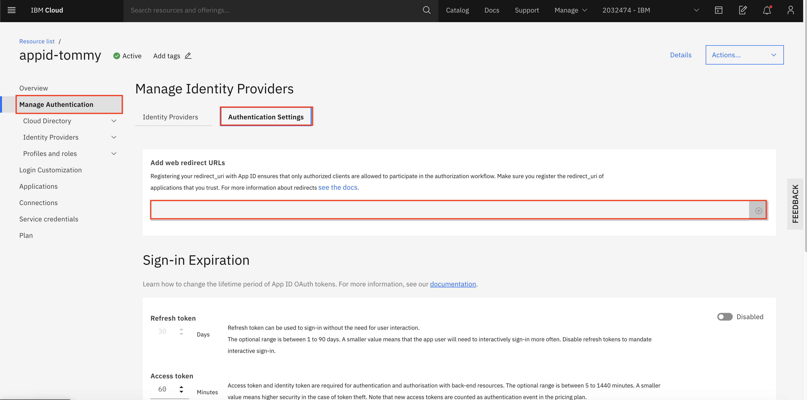

This guide describes how to use the kfctl binary to deploy Kubeflow on IBM Cloud Kubernetes Service (IKS).

## Prerequisites

* Authenticate with IBM Cloud

  Log into IBM Cloud at [IBM Cloud](https://cloud.ibm.com)

* Install OpenShift CLI

  OpenShift CLI is the way to manage and access OpenShift cluster. You can [Install OpenShift CLI](https://cloud.ibm.com/docs/openshift?topic=openshift-openshift-cli) from this instructions.

* Create and access a OpenShift cluster on IKS

  To deploy Kubeflow on IBM Cloud, you need a cluster running OpenShift on IKS. If you don't have a cluster running, follow the [Create an IBM Cloud OpenShift cluster](https://cloud.ibm.com/docs/openshift?topic=openshift-clusters) guide.

  To access the cluster follow these directions [Access OpenShift Cluster](https://cloud.ibm.com/docs/openshift?topic=openshift-access_cluster). We can easily get access from the openshift console on IBM Cloud[Connecting to the cluster from the console](https://cloud.ibm.com/docs/openshift?topic=openshift-access_cluster#access_oc_console).

## Hardware Requirement

We have tested this on OpenShift 4.5 and 4.6. We have plans for testing on OpenShift 4.7 but given its not yet generally available on IBM Cloud this may take some time. 

For installing kubeflow we recommend using a `4 x 16 x 3` cluster. But for kubeflow for multiuser the for more the 3 person you might hit cpu limit. To avoid that you should deploy machines with more cpu. `8 x 16 x 2` is a good option. 
# Installation

## Single User

Use the [official kubeflow docs for openshift](https://www.kubeflow.org/docs/distributions/openshift/install-kubeflow/) for single user kubeflow 1.3 installation.
## Multi-user, auth-enabled

Run the following steps to deploy Kubeflow with [IBM Cloud AppID](https://cloud.ibm.com/catalog/services/app-id)
as an authentication provider. 

The scenario is a Kubeflow cluster admin configures Kubeflow as a web
application in AppID and manages user authentication with builtin identity
providers (Cloud Directory, SAML, social log-in with Google or Facebook etc.) or
custom providers.

### Prerequisites

For authentication,  IBM Cloud uses [AppID](https://cloud.ibm.com/catalog/services/app-id)

1. Follow the [Creating an App ID service instance on IBM Cloud](https://cloud.ibm.com/catalog/services/app-id) guide to learn about Kubeflow authentication. 
You can also learn [how to use App ID](https://cloud.ibm.com/docs/appid?topic=appid-getting-started) with different authentication methods.

2. Follow the [Registering your app](https://cloud.ibm.com/docs/appid?topic=appid-app#app-register) section of the App ID guide
to create an application with type _regularwebapp_ under the provisioned AppID
instance. Make sure the _scope_ contains _email_. Then retrieve the following
configuration parameters from your AppID:
    * `clientId`
    * `secret`
    * `oAuthServerUrl`

    You will be using these information in the subsequent sections.  
  
3. Register the Kubeflow OIDC redirect page. The Kubeflow `REDIRECT_URL` URL is `http://<kubeflow-FQDN>/login/oidc`. 
`<kubeflow-FQDN>` is the endpoint for accessing Kubeflow. In openshift we setup a route for our `istio-ingresgateway`. 

1. Then, you need to place the Kubeflow OIDC `REDIRECT_URL` under **Manage Authentication** > **Authentication settings** > **Add web redirect URLs**.
  


### Using kfctl

1. Set up environment variables:

    ```shell
    export KF_NAME=<your choice of name for the Kubeflow deployment>

    # Set the path to the base directory where you want to store one or more 
    # Kubeflow deployments. For example, use `/opt/`.
    export BASE_DIR=<path to a base directory>

    # Then set the Kubeflow application directory for this deployment.
    export KF_DIR=${BASE_DIR}/${KF_NAME}
    ```

2. Set up configuration files:

    ```shell
    export CONFIG_FILE=kfctl_ibm_multi_user.yaml
    export CONFIG_URI="https://raw.githubusercontent.com/IBM/KubeflowDojo/master/OpenShift/manifests/kfctl_openshift_multu.v1.3.0.yaml"
    # Generate and deploy Kubeflow:
    mkdir -p ${KF_DIR}
    cd ${KF_DIR}
    curl -L ${CONFIG_URI} > ${CONFIG_FILE}
    ```
    
> **Note**: By default, the IBM configuration is using the [Kubeflow pipeline with the Tekton backend](https://github.com/kubeflow/kfp-tekton#kubeflow-pipelines-with-tekton).
If you want to use the Kubeflow pipeline with the Argo backend, modify and uncomment the `kfp-argo` applications inside the `kfctl_ibm_multi_user.yaml` and remove the `kfp-tekton` applications. 

> There are components that are strictly required for using kubeflow. Like `pytorch` or `xgboost` you can comment these applications out from your `kfdef` file.
    
1. Deploy Kubeflow:

    ```shell
    kfctl apply -V -f ${CONFIG_FILE}
    ```

2. Wait until the deployment finishes successfully — for example, all pods should be in the `Running` state when you run the command:

    ```shell
    kubectl get pod -n kubeflow
    ```

3. Update the configmap `oidc-authservice-parameters` and secret `oidc-authservice-client` in the `istio-system` namespace that holds the information needed by the `authservice`.

We will be updating these to match our `appid` service created in the [Prereq](#prerequisites) step. 

You will need the following values:


 * `<oAuthServerUrl>` - fill in the value of oAuthServerUrl
 * `<clientId>` - fill in the value of clientId
 * `<secret>` - fill in the value of secret
 * `<kubeflow-FQDN>` - fill in the FQDN of Kubeflow, if you don't know yet, just give a dummy one like `localhost`. Then change it after you got one.

##### Patch ConfigMap

Get the route to your `istio-ingresgateway`. That is the `<kubeflow-fqdn>`.
Once we have the application up we can get the route using:

```bash
oc get route -n istio-system istio-ingressgateway -o=jsonpath='{.spec.host}'
```

```bash
export OIDC_PROVIDER=<oAuthServerUrl>
export OIDC_AUTH_URL=<oAuthServerUrl>/authorization
export REDIRECT_URL=http://<kubeflow-fqdn>/login/oidc

export PATCH=$(printf '{"data": {"OIDC_AUTH_URL": "%s", "OIDC_PROVIDER": "%s", "REDIRECT_URL": "%s"}}' $OIDC_AUTH_URL $OIDC_PROVIDER $REDIRECT_URL)

kubectl patch cm -n istio-system oidc-authservice-parameters -p=$PATCH
```

##### Patch Secret

```bash
export CLIENT_ID=<clientId>
export CLIENT_SECRET=<secret>

export PATCH=$(printf '{"stringData": {"CLIENT_ID": "%s", "CLIENT_SECRET": "%s"}}' $CLIENT_ID $CLIENT_SECRET)

kubectl patch secret -n istio-system oidc-authservice-client -p=$PATCH
```
 
 **Note**: If any of the parameters are changed after the initial Kubeflow deployment, you 
 will need to manually update these parameters in the configmap `oidc-authservice-parameters` and/or secret `oidc-authservice-client`.
 Then, restart authservice by deleting the existing pod `kubectl delete po -n istio-system authservice-0 `.

## Accessing our cluster

Once the `oauthservice` is up and properly configured we can visit `<kubeflow-fqdn` to access our application. Make sure to add `http://` infront of the url since we have not setup `https://` yet. 

If everything is setup correctly we should be redirected to `appid` login page to sign in.

## Profile Creation Caveats

We have automatic profile creation enabled. But at this moment we do not have a way to create the permissions and resources needed for the new namespace. To enable the new namespace to function properly we need to run some additional commands. 

```bash
export TARGET_NAMESPACE=<target-namespace> #the namespace created for the new profile

cat <<EOF | oc create -f -
apiVersion: "k8s.cni.cncf.io/v1"
kind: NetworkAttachmentDefinition
metadata:
  name: istio-cni
  namespace: $TARGET_NAMESPACE
EOF

oc adm policy add-scc-to-group privileged system:serviceaccounts:$TARGET_NAMESPACE

oc adm policy add-scc-to-group anyuid system:serviceaccounts:$TARGET_NAMESPACE
```

## Next steps: secure the Kubeflow dashboard with HTTPS

Follow the [official guide on kubeflow](https://www.kubeflow.org/docs/distributions/ibm/deploy/install-kubeflow-on-iks/#next-steps-secure-the-kubeflow-dashboard-with-https) for setting up https

## Troubleshooting

* If pods are not starting up. Check the logs. There might be some issues with scc permissions. 

* If you are on OpenShift 4.7 we are not done testing on that platform yet. So there might be some issues there. 

