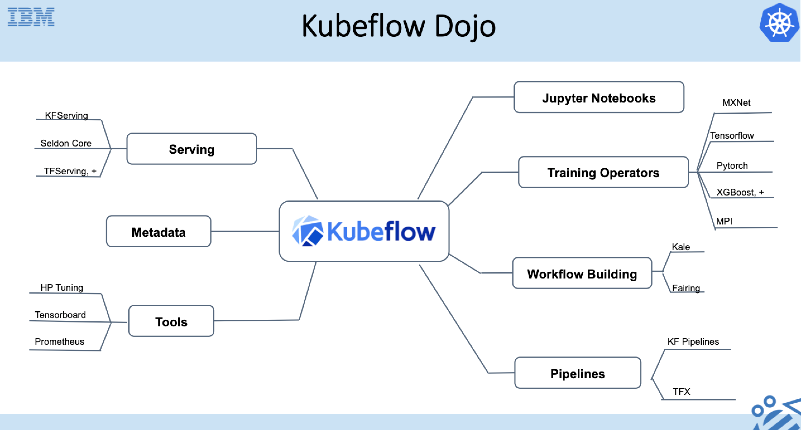

# Kubeflow Dojo
Repository to hold code, instructions, demos and pointers to presentation assets for [Kubeflow](https://github.com/kubeflow) Dojo. In this Dojo, we are going to address how to  make it easy for everyone to develop, deploy, and manage portable, scalable ML everywhere and support the full lifecycle Machine Learning using [Kubeflow](https://www.kubeflow.org/). We are going to discuss how to deploy and manage Kubeflow, and detail how to enable distributed training of models, model serving, canary rollouts, drift detection, model explainability, metadata management, pipelines and others. 

To enable developers who want to use it at their own pace, pre-recorded sessions are uploaded. For those who prefer live interactions, we will be running the sessions and workshops live.

Read about [IBM's journey with Kuebflow here](https://developer.ibm.com/blogs/kubeflow-and-ibm-an-open-source-journey-to-10/)

# Live Schedule and Prereqs

**When:** July 15th and 16th. All times listed are in PST time zone

**Wed July 15, 2020:** End to end presentation and walk through on Kubeflow, followed by detailed deep dive and hands on deploying Kubeflow to Minikube and/or IBM Cloud Kubernetes Service (IKS).

**Thu July 16, 2020:** Deeper dive sessions and demos on Kubeflow Pipelines, Kubeflow Serving (KFServing), Distributed Training Operators and HPO, and Kubeflow PR workflow

**Where:** Please register at the following link: http://ibm.biz/KubeflowDojo

The Kubeflow Slack workspace is kubeflow.slack.com. To join, click this [invitation to Kubeflow Slack workspace](https://join.slack.com/t/kubeflow/shared_invite/zt-cpr020z4-PfcAue_2nw67~iIDy7maAQ). There is a channel **#kubeflow-dojo** created for the workshop.

**Prereqs:** Please look at [prereqs here](https://github.com/IBM/KubeflowDojo/blob/master/prereqs.md)

**Note:** For Pipelines, we are using [Kubeflow Pipelines with Tekton](https://github.com/kubeflow/kfp-tekton) in this workshop

Date: **Wed July 15, 2020**
|Time|Topic|Presenter|Links|
|---|---|---|---|
|8:00am - 8:20 am|Trusted and Responsible AI through Open Source |Animesh|
|8:20am - 9:30am|Basics of Git and Github|Morgan Bauer|[Slides](https://ibm.box.com/s/6px867ufg2dmuw15weoac6n8rukr7mmr) [Videos](https://video.ibm.com/embed/recorded/126773542)|
|9:30am - 10:45 am|Kubeflow - End to end ML on Kubernetes|Animesh|[Kubeflow End to End](https://www.slideshare.net/AnimeshSingh/end-to-end-machine-learning-using-kubeflowbuild-train-deploy-and-manage)|
|10:45am - 11:00am|Break|||
|11:00am - 11:30am|Kubeflow Development Environment|Weiqiang|[Slides](Presentations/DevEnv.pdf) [Video](https://youtu.be/BeP5O4jEmAQ)|
|11:30am - 12:00 pm |Kubeflow Control Plane deep dive|Weiqiang|[Slides](Presentations/KubeflowControlPlane.pdf) [Video](https://youtu.be/rQaqJxwlpLk)|
|12:00pm - 1:00pm|Lunch break|||
|1:00pm - 2:30pm|Kubeflow Deployment Hands On|Weiqiang, Shawn, Tommy|[Deployment on IKS](HandsOn/Deployment/kubeflow-on-iks.md) [Deployment on minikube](HandsOn/Deployment/kubeflow-on-minikube.md)|
|2:30am - 2:45am|Break|||
|2:45pm - 3:30pm|Tryout Kubeflow Components |Tommy| [Hands On Notebook](/HandsOn/day1)|
|3:30pm - 4:00pm|Q&A|||

**Recordings for live sessions:** [https://www.youtube.com/playlist?list=PLueW2CELjTGpGV7czs41eXu3UpfXTbicz](https://www.youtube.com/playlist?list=PLueW2CELjTGpGV7czs41eXu3UpfXTbicz)

Date: **Thu July 16, 2020**

|Time|Topic|Presenter|Links|
|---|---|---|---|
|8:00am - 8:30am|Overview of Kubeflow repos|Tommy|[Slides](Presentations/KubeflowRepos.pdf)|
|8:30 am - 9:30am|Kubeflow Pipelines deep dive|Animesh, Tommy, Christian|[Slides](https://www.slideshare.net/AnimeshSingh/kubeflow-pipelines-with-tekton-236769976) [Video](https://youtu.be/PoEhn5teUcU)|
|9:30am - 9:45am|Break|||
|9:45 am - 10:45am|Kubeflow Pipelines-Tekton hands on| Christian Kadner, Tommy Li|[KFP with Tekton](/HandsOn/KFP-Tekton/)|
|10:45am - 11 am|Break|||
|11:00am - 12 am|KFServing deep dive|Animesh, Tommy|[Slides](https://www.slideshare.net/AnimeshSingh/kfserving-serverless-model-inferencing-236725227) [Video](https://youtu.be/EGDDYkeS-zc) [Demo](/demo-materials/day2-kfs/kfs.ipynb)|
|12:00pm - 1:00pm|Lunch break|||
|1:00pm - 2:00pm |Distributed Training and HPO Deep Dive |Andrew, Kevin, Animesh|[Slides](https://www.slideshare.net/AnimeshSingh/kubeflow-distributed-training-and-hpo) [Video](https://youtu.be/6GYuRy84M1o)|
|2:00pm - 2:15pm|Break|||
|2:15pm - 2:30pm|Kubeflow PR workflow|Weiqiang|[Slides](Presentations/PRworkflow.pdf) [Video](https://youtu.be/4EBQkfbbUTM)|
|2:30pm - 3:30pm|PR workflow handson||[PR workflow](HandsOn/PRworkflow/PRworkflow.md)|
|3:30pm - 4:00pm|Wrap up and final Q&A|Animesh||
