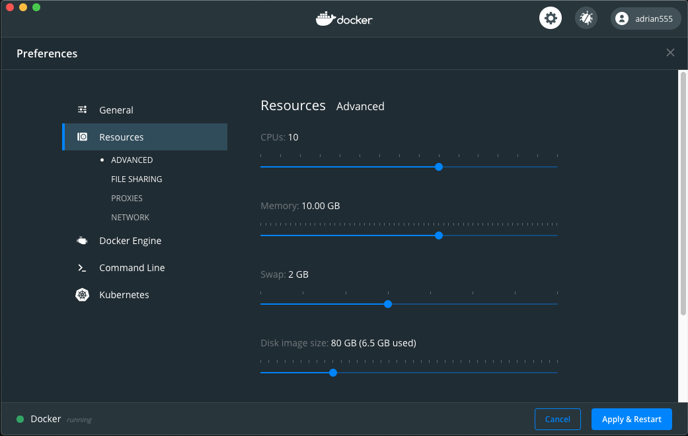
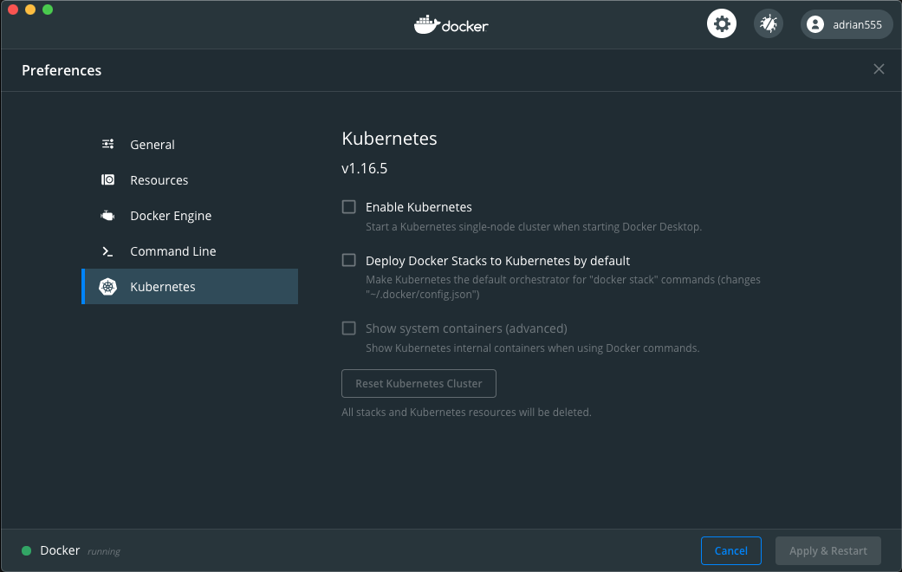
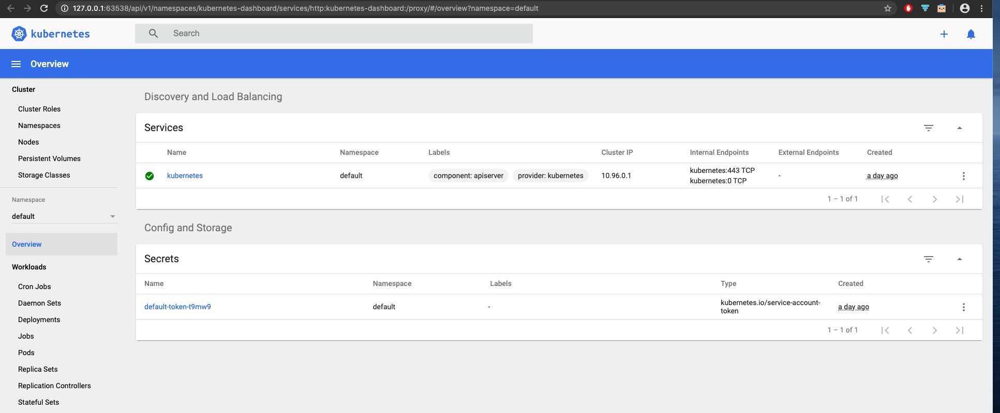

# Install minikube

On a laptop or VM to run the `minikube` cluster, the `docker` engine must be running before further into other steps.

To have the `docker` engine install, refer to its [document](https://docs.docker.com/get-docker/).

As an example, on a MacOS laptop, the **Docker Desktop** should be installed with the [instruction](https://docs.docker.com/docker-for-mac/install/). After it is installed, go to its preferences and make some configuration changes similar to follow  to give the to-be-created cluster enough CPU resources.

Current **Docker Desktop** on MacOS has an option to start a one-node Kubernetes cluster, one may enable  it and use the cluster for the dojo.

Alternatively one should install and set up a `minikube` cluster. This is also preferred by this dojo. Reason for such choice is obvious as developers working on many cloud related projects are not deploying services directly on their MacOS laptop.

To install `minikube`, follow this [link](https://kubernetes.io/docs/tasks/tools/install-minikube/). It basically includes three steps:

* install [`kubectl`](https://kubernetes.io/docs/tasks/tools/install-kubectl/). For the purpose of this dojo, please choose version v1.15.6 of `kubectl` to install.

* install a hypervisor. On Ubuntu and other linux VM, a `minikube` cluster can run without a hypervisor and so this step can be bypassed.

* install `minikube`.

# Start minikube

For the purpose of this dojo, we recommend start up a `minikube` cluster with following command line:

```shell
  minikube start --driver=docker --memory=8192MB --cpus=6 --disk-size=30000mb --kubernetes-version=v1.15.6
```

Note: on Linux VM, you can set the `--driver=none` to not use a hypervisor.

This configuration takes into account of the memory and cpu resources that are suitable to run a Kubeflow deployment with most of essential applications.

Once the `minikube` cluster is up and running, you should see some screen output like following .

Like other Kubernetes clusters, you can also view the `minikube` cluster dashboard with this command:

```shell
minikube dashboard&
```

The dashboard with show on your default web browser like this. 
